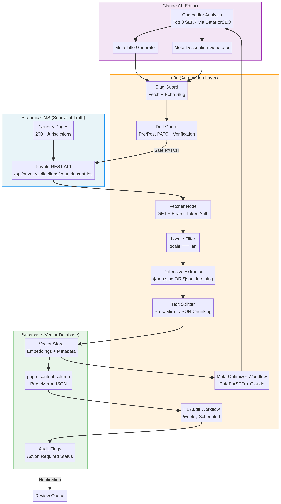

# IDA AI-Powered SEO Engine

> **Version**: 1.0 (Blueprint) | **Status**: Pre-Build / Planning Complete | **Stack**: n8n · Supabase · Statamic · Claude AI

An intelligence layer built on top of the International Drivers Association's existing Statamic CMS. This system automates SEO auditing, metadata optimization, and internal linking across 200+ country-specific pages using AI-driven workflows — without increasing operational headcount.

> **Acquisition Notice**: This project is currently in the pre-build stage. All architecture, requirements, and safety patterns are fully documented. See [`docs/PROJECT_STATUS.md`](docs/PROJECT_STATUS.md) for a complete build status log.

---

## Table of Contents

1. [Project Overview](#1-project-overview)
2. [System Architecture](#2-system-architecture)
3. [Tech Stack](#3-tech-stack)
4. [Project Phases](#4-project-phases)
5. [Technical Implementation Guidelines](#5-technical-implementation-guidelines)
6. [Repository Structure](#6-repository-structure)
7. [Setup & Onboarding Roadmap](#7-setup--onboarding-roadmap)
8. [Documentation Index](#8-documentation-index)
9. [Contributing](#9-contributing)

---

## 1. Project Overview

The International Drivers Association (IDA) manages an extensive grid of country-specific web pages spanning over 200 jurisdictions. This project introduces an **Intelligence Layer** on top of the existing Statamic CMS by connecting it to n8n (automation), Supabase (vector database), and Claude AI (content editor).

The core mission is to transition from manual, time-intensive content management to a fully automated, AI-driven SEO pipeline. The system enables IDA to scale auditing, optimization, and internal linking operations without proportional increases in headcount — a critical operational advantage for both current operations and acquisition positioning.

**Primary Goals**

| Goal | Description |
| :--- | :---------- |
| **Centralize Site Intelligence** | Move all page content and SEO metadata into a searchable Supabase Vector Store |
| **Automate Audits** | Instantly identify H1 violations and structural issues across 200+ jurisdictions |
| **Semantic Optimization** | Use Claude AI to rewrite metadata based on real-time competitor SERP data |
| **Contextual Linking** | Automatically identify and propose internal links via semantic vector matching |

---

## 2. System Architecture

The system operates as a continuous closed loop. n8n pulls content from Statamic, processes and stores it in Supabase with AI assistance, and — after human review — pushes optimizations back to Statamic safely.

```
Statamic CMS  ──►  n8n (Automation)  ──►  Supabase (Vector DB)
      ▲                                           │
      │                                     Claude AI
      └──────────── Safe PATCH (Slug Guard + Drift Check) ◄──────
```



| Component | Role | Responsibility |
| :-------- | :--- | :------------- |
| **Statamic** | The "Body" | Source of truth for all page content and metadata |
| **n8n** | The "Nervous System" | Orchestrates all data movement, transformation, and scheduling |
| **Supabase** | The "Brain" | Stores vectorized content and metadata; powers semantic search and audits |
| **Claude AI** | The "Editor" | Analyzes competitor data and drafts optimized meta titles and descriptions |

---

## 3. Tech Stack

| Technology | Version | Purpose |
| :--------- | :------ | :------ |
| **n8n** | Latest | Workflow automation, scheduling, API orchestration |
| **Supabase** | Latest | PostgreSQL + pgvector for semantic search and metadata storage |
| **Statamic** | Latest | Flat-file CMS; primary content source via Private REST API |
| **Claude (Anthropic)** | Latest | LLM for meta content analysis and generation |
| **DataForSEO** | API v3 | SERP competitor data sourcing for Phase 2 |

---

## 4. Project Phases

### Phase 0 — Intelligence Indexer (Ingestion)

**Goal**: Populate Supabase with every country page from Statamic to enable all future automations.

The ingestion workflow calls `GET /api/private/collections/countries/entries` using Bearer Token authentication. Because the Statamic API returns entries for all locales regardless of the `?site=` parameter, an n8n Filter Node **must** retain only entries where `locale === 'en'`. A Defensive Extractor pattern handles the inconsistency where fields may appear at the top-level or inside a nested `data` object (e.g., `{{ $json.slug || $json.data.slug }}`). Content is chunked using the Recursive Character Text Splitter and stored as vector embeddings in Supabase.

### Phase 1 — Structural & H1 Audit

**Goal**: Identify and flag structural SEO weaknesses across the full page grid on a weekly cadence.

A scheduled n8n workflow scans the `page_content` column in Supabase, counting heading nodes where `attrs.level === 1`. Any page where the H1 count is not exactly 1 is flagged as "Action Required" in Supabase, and a notification is dispatched to a human review queue. This is a read-only workflow — no content is modified.

### Phase 2 — Meta & Content Optimizer

**Goal**: Automate the rewriting of page titles and descriptions to outperform SERP competitors.

The workflow fetches the top 3 SERP competitors via DataForSEO, sends the current `meta_title` alongside competitor data to Claude AI, and receives optimized meta titles and descriptions in return. Before any PATCH request is made to Statamic, the **Slug Guard** (see Section 5) and **Drift Check** patterns are applied to ensure data integrity.

---

## 5. Technical Implementation Guidelines

### The Slug Guard (Critical — Must Implement Before Any Write-Back)

Statamic will **delete a page's URL** if the `slug` field is omitted from a PATCH request. Every n8n workflow that writes back to Statamic must first fetch the current slug and explicitly include it in the PATCH request body, even when the slug is not being modified.

### The Drift Check (Pre/Post Verification Pattern)

Every write-back workflow must implement the following three-step verification:

1. **Capture**: Record the state of critical fields (`title`, `slug`, etc.) before the PATCH.
2. **Patch**: Execute the PATCH request.
3. **Compare**: Verify the response to confirm that guarded fields have not changed unexpectedly.

### Handling Statamic Data Types

**Select Fields** (e.g., Continent) are returned by the API as full objects. When writing back via PATCH, only the raw string key must be sent (e.g., `"south-america"`, not the full object).

**Bard Fields** store content as ProseMirror JSON. n8n workflows must manipulate the JSON nodes directly and must not convert content to raw HTML, as this would corrupt Statamic's native formatting.

---

## 6. Repository Structure

```
ida-ai-seo-engine/
├── README.md                          # This file
├── CHANGELOG.md                       # Version history and planned feature log
├── .gitignore
├── .github/
│   ├── PULL_REQUEST_TEMPLATE.md       # PR checklist with safety gates
│   └── ISSUE_TEMPLATE/
│       ├── bug_report.md
│       └── feature_request.md
└── docs/
    ├── PROJECT_STATUS.md              # Live build status tracker (acquisition log)
    ├── IDA_AI_Powered_SEO_Engine_PRD.md          # Full Product Requirements Document
    ├── IDA_AI_Powered_SEO_Engine_Architecture_System_Design.md  # Architecture spec
    ├── api_integration_reference.md   # API & integration reference
    ├── Contributing_Maintenance_Guide.md  # Contributor guide & onboarding
    ├── architecture.mmd               # Mermaid source diagram
    └── architecture.png               # Rendered architecture diagram
```

---

## 7. Setup & Onboarding Roadmap

| Week | Focus | Key Activities | Outcome |
| :--- | :---- | :------------- | :------ |
| **Week 1** | Setup & Ingestion | Deploy n8n, configure Supabase, set up Statamic Bearer Token auth, run Phase 0 for 10 test pages | Functional ingestion pipeline validated on test data |
| **Week 2** | H1 Audit | Build the read-only H1 Audit workflow; learn n8n logic safely with no write-back risk | Automated weekly H1 violation detection operational |
| **Week 3** | Meta Optimizer | Implement Phase 2 with DataForSEO + Claude; deploy Slug Guard and Drift Check before any live PATCH | AI-driven meta optimization running safely in production |

---

## 8. Documentation Index

| Document | Description |
| :------- | :---------- |
| [`docs/PROJECT_STATUS.md`](docs/PROJECT_STATUS.md) | Live build status, component tracker, risk register — primary acquisition reference |
| [`docs/IDA_AI_Powered_SEO_Engine_PRD.md`](docs/IDA_AI_Powered_SEO_Engine_PRD.md) | Full Product Requirements Document with success metrics and scalability plan |
| [`docs/IDA_AI_Powered_SEO_Engine_Architecture_System_Design.md`](docs/IDA_AI_Powered_SEO_Engine_Architecture_System_Design.md) | Detailed system architecture, data flow, and safety patterns |
| [`docs/api_integration_reference.md`](docs/api_integration_reference.md) | API endpoints, authentication, field handling, and integration specs |
| [`docs/Contributing_Maintenance_Guide.md`](docs/Contributing_Maintenance_Guide.md) | Contributor guidelines, maintenance patterns, and onboarding roadmap |
| [`CHANGELOG.md`](CHANGELOG.md) | Full history of changes and planned feature backlog |

---

## 9. Contributing

Before contributing, please read [`docs/Contributing_Maintenance_Guide.md`](docs/Contributing_Maintenance_Guide.md) in full. All pull requests must pass the safety checklist defined in [`.github/PULL_REQUEST_TEMPLATE.md`](.github/PULL_REQUEST_TEMPLATE.md), with particular attention to the Slug Guard and Drift Check requirements for any workflow that writes back to Statamic.

---

*IDA AI-Powered SEO Engine — Version 1.0 Blueprint | International Drivers Association*
